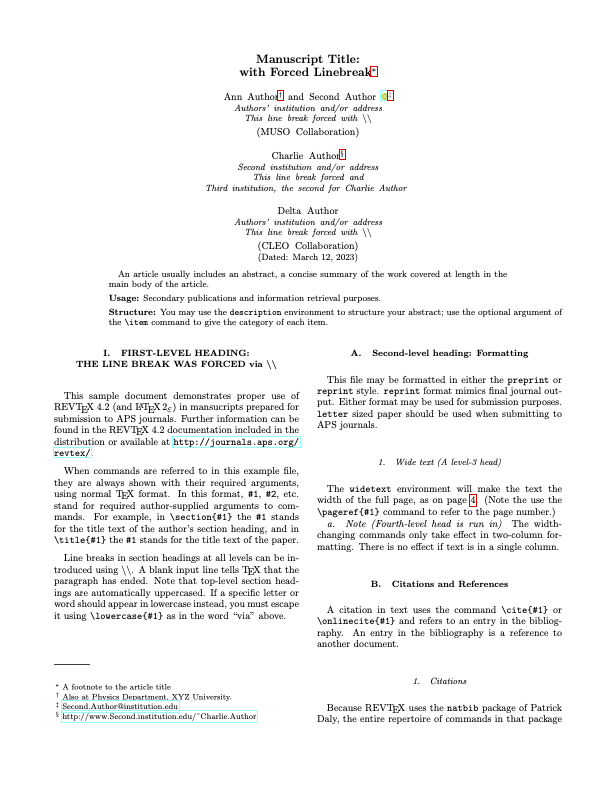

# Physical Review Journals

Template for Physical Review Journals

- Author: Frank Zimmer 
- Author Website: https://www.frankzimmer.net
- [Submission Guidelines](https://journals.aps.org/prl/authors)

## Steps to creating your own template!

- [x] 🆕 Create this repository. Nailed it. 🚀
- [x] 📑 Replace the `template.tex` with your existing LaTeX template/article
- [x] 👯‍♀️ Copy in any other style, definitions or images necessary for the template
- [x] 👩‍🔬 Add the files necessary into `files` list in the `template.yml` ([documentation](https://js.myst.tools/jtex/template-yml))
- [x] 🧙‍♀️ Start replacing template values with `[-options.my_value-]` and put in `[# if parts.abstract #]` conditions to toggle sections on and off ([documentation](https://js.myst.tools/jtex/template-rules))
- [x] 👩🏿‍💻 Install [jtex](https://js.myst.tools/jtex) (`npm install -g jtex`) and run `jtex check` ([documentation](https://js.myst.tools/jtex/command-line))
- [x] 🪄 Continue to improve the options in your template for `parts` and `options` ([documentation](https://js.myst.tools/jtex/document))
- [x] 💾 When ready, save your `template.yml` and run `jtex check --fix`, this will add various packages that are auto detected and fix document options ([documentation](https://js.myst.tools/jtex/command-line))
- [x] 🧪 Test with real content: `myst build my-document.md --template ../path/to/template` ([documentation](https://js.myst.tools/guide/creating-pdf-documents))
- [ ] 📸 Create a `thumbnail.png` with an accurate screenshot of the template
- [x] 🧭 Update this README, and check all values in the `template.yml`
- [x] 🚀 Push to GitHub, and contribute to the [community templates repository](https://github.com/myst-templates/templates)

## Options provided by Physical Review Journals `myst`-Template

The RevTex documentation used to setup this template can be found here:

- [REVTEX 4.2 Author’s Guide](https://ctan.math.illinois.edu/macros/latex/contrib/revtex/auguide/auguide4-2.pdf)
- [REVTEX 4.2 Command and Options Summary](https://ctan.math.illinois.edu/macros/latex/contrib/revtex/auguide/summary4-2.pdf)

This is a table of options the template provides based on the [REVTeX 4.2e](https://journals.aps.org/revtex) release:

| Option | Type | Default | Required | Functionality |
| ------ | ---- | ------- | -------- | ------------- |
| `draft`  | boolean| false | false    | Marks the document as drift (preprint) |
| `preprint`  | string |  | false    | Institutional report numbers can be specified using this (see prepint revtex4-2 documentation). |
| `linenumbers`  | boolean| false | false    | Allows to add line numbers to the generated article. |
| `superscriptaddress`  | boolean| false | false    | A major way of displaying authors and affiliations information is to use superscripts on the authors and affiliations. It should be mentioned that the affiliations for the `superscriptaddress` are presented and numbered in the order that they are encountered. |
| `groupedaddress`  | boolean| true | false  | To group authors with the same affiliation together this option can be chosen. This is the default behavior for most journals. |
| `unsortedaddress`  | boolean| false | false  | Grouping of authors into specific groups (see `groupedaddress`) is disabled. |
| `runinaddress`  | boolean| false | false  | Like `groupedaddress`, but joins multiple affiliations together into a single sequence separated by commas. |
| `frontmatterverbose`  | boolean| false | false  | More verbose display of authors and affiliations. |
| `footinbib`  | boolean| false | false  | The footnote text can either appear at the bottom of a page or as part of the bibliography. This option results it in only showing up in the bibliography. This can be used to override the default behavior of the journal. |
| `nofootinbib`  | boolean| false | false  | The footnote text can either appear at the bottom of a page or as part of the bibliography. This option results it in only showing up on the bottom of the page. This can be used to override  the default behavior of the journal. |
| `bibnotes`  | boolean| false | false  | Specifies whether additional author information such as email or homepage are put on the first page or at the st of the bibliography. For instance, the prb option puts all such footnotes at the start of the bibliography while the prl journal styles displays them on the first page. One can override a journal style’s default behavior by specifying explicitly the class option bibnotes (puts the footnotes at the start of the bibliography) or nobibnotes (puts them on the first page).|
| `nobibnotes`  | boolean| false | false  | Specifies whether additional author information such as email or homepage are put on the first page or at the st of the bibliography. For instance, the prb option puts all such footnotes at the start of the bibliography while the prl journal styles displays them on the first page. One can override a journal style’s default behavior by specifying explicitly the class option `bibnotes` (puts the footnotes at the start of the bibliography) or `nobibnotes` (puts them on the first page).|
| `reprint`  | boolean| false | false  | Closely approximate a given journal’s style. Can be either single or two-column formatting depending on the journal.|
| `footnote_title`  | boolean| false | false  | Adds footnote for the article title.|
| `styling`  | choice | aps | true  |  Allows to choose the types of American Physical Society journals. The following choices are available:<ul><li> American Physical Society (aps),</li><li> American Institute of Physics (aip),<li>American Association of Physicists in Medicine (aapm),<li>Society of Rheology (sor)</li></ul>|
| `aps_journal_type`  | choice | pra | false  |  Allows to choose the APS Journal type. The following choices are available:<ul><li> Physical Review Letter (prl),</li><li> Physical Review A (pra),<li> Physical Review B (prb),<li>Physical Review C (prc)</li><li>Physical Review D (prd)</li><li>Physical Review E (pre)</li><li>Physical Review Accelerators and Beams (prab)</li><li>Physical Review Education Research (prper)</li><li>Physical Review X (prx)</li><li>Physical Review Applied (prapplied)</li><li>Physical Review Fluids (prfluids)</li><li>Physical Review Materials (prmaterials)</li><li>Physical Review (physrev)</li><li>Review of Modern Physics (rmp)</li></ul>|
| `aip_journal_type`  | choice | apl | false |  Allows to choose the AIP Journal type. The following choices are available:<ul><li>Applied Physics Letters (apl),</li><li>Biomicrofluids (bmf),<li> Chaos: An Interdisciplinary Journal of Nonlinear Science (cha),<li>Journal of Applied Physics (jap)</li><li>Journal of Chemical Physics (jcp)</li><li>Journal of Mathematical Physics (jmp)</li><li>Journal of Renewable & Sustainable Energy (rse)</li><li>Physics of Fluids (pof)</li><li>Physics of Plasmas (pop)</li><li>Review of Scientific Instruments (rsi)</li><li>APL Materials (apm)</li><li>AIP Advances (adv)</li><li>Structural Dynamics (sd)</li></ul>|
| `aapm_journal_type`  | choice | mph | false |  Allows to choose the American Association of Physicists in Medicine journal type. The following choices are available:<ul><li>??? (mph)</li></ul>|
| `sor_journal_type`  | choice | jor | false |  Allows to choose the Society of Rheology journal type. The following choices are available:<ul><li>Journal of Rheology (jor)</li></ul>|
| `formatting`  | choice | onecolumn | false |  Allows to choose the type of column formatting (one- or two-column article). The following choices are available:<ul><li>onecolumn</li><li>twocolumn</li></ul>|

## Open Issues

- [ ] Fix warning when compiling PDF
- [ ] Provide example article that uses all introduced new options
- [ ] Is it possible to use `affiliations` under the document properties to introduce `altaffilations` in Physical Review Journals?
- [ ] `frontmatterverbose` option's description needs clarification
- [ ] `physrev` Journal name is unclear
- [ ] There are still more journals at [AIP Publishing](https://aip.scitation.org) which we have not covered yet. What are their abbreviations?
- [ ] `mph` name is unclear
- [ ] There are still more journals at [AAPM](https://www.aapm.org/pubs/). What are there abbreviations?
